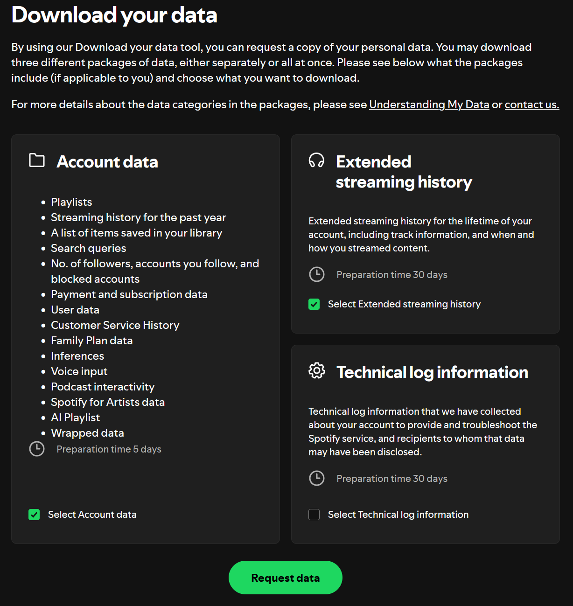

# my_spotify_data_web_eda
This project provides a self-hosted web application for visualising cool insights on your spotify streaming history data 

## 1. Collecting your spotify data

- Go to your spotify account privacy page ->  https://www.spotify.com/us/account/privacy/

- Go to the **Download my data** section 
- (Optional) select **Extended streaming history**
- Click on **Request Data**
- Wait for the data file that will be sent to you on your email address
- Confirm your email address in the email that spotify just sent you
- Wait
- Eat a pizza
- Wait more

## 2. Visualising

TODO..